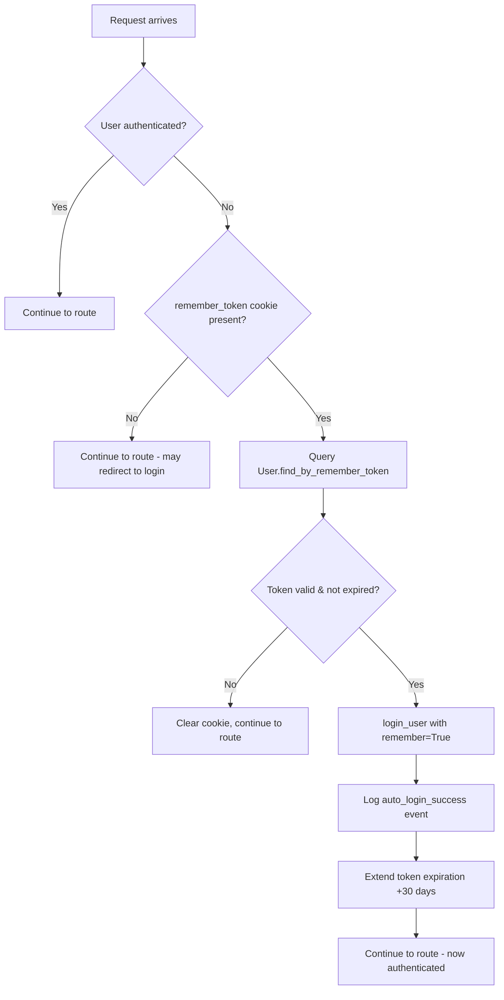

# Remember Me / Auto-Login System Implementation

## Overview

This document describes the "Remember Me" persistent authentication system that allows users to bypass the login screen on trusted devices for up to 30 days after their last login.

---

## Features

### ✅ Implemented Features

1. **Persistent Authentication Token**
   - Secure, cryptographically random 32-byte token stored in database
   - 30-day expiration period from last use
   - Automatic expiration extension on each use (rolling 30-day window)

2. **Automatic Login**
   - Transparent auto-login via `@app.before_request` handler
   - Works for both web and Electron offline applications
   - No manual intervention required after initial "Remember Me" selection

3. **Cookie-Based Storage**
   - HttpOnly cookie (prevents JavaScript access - XSS protection)
   - SameSite=Lax (CSRF protection)
   - 30-day max-age matching token expiration
   - Automatically cleared on manual logout

4. **Security Logging**
   - All auto-logins logged with `auto_login_success` event (severity 0)
   - All manual logouts clear tokens and log `logout` event
   - Invalid/expired token attempts logged (no event, just debug log)

5. **User Preference**
   - Per-user `remember_enabled` flag in database
   - User can opt-in or opt-out via checkbox on login form
   - Preference persists across logins

6. **Graceful Degradation**
   - If token is invalid/expired, user is redirected to login (no error)
   - If database is unavailable, feature fails silently (no crash)
   - Errors logged for debugging but don't break user experience

---

## Architecture

### Database Schema

The `users` table includes these fields (already in schema):

```sql
remember_token TEXT,                -- Secure random token
remember_token_expiration TIMESTAMP,  -- UTC expiration datetime
remember_enabled BOOLEAN DEFAULT 0     -- User preference flag
```

### Token Generation

```python
def generate_remember_token(self):
    """Generate a new remember token for persistent authentication"""
    import secrets
    token = secrets.token_urlsafe(32)
    self.remember_token = token
    # Set token expiration to 30 days from now
    self.remember_token_expiration = datetime.utcnow() + timedelta(days=30)
    return token
```

- Uses `secrets.token_urlsafe(32)` for cryptographically secure randomness
- 32 bytes = 256 bits of entropy
- URL-safe base64 encoding (no special characters in cookie)

### Token Verification

```python
def verify_remember_token(self, token):
    """Verify if the provided remember token is valid and not expired"""
    if not self.remember_token or not self.remember_token_expiration:
        return False
    
    # Safely parse the expiration datetime
    expiration_dt = safe_parse_datetime_field(self.remember_token_expiration)
    if not expiration_dt:
        return False
        
    # Check if token matches and hasn't expired
    if self.remember_token == token and datetime.utcnow() < expiration_dt:
        return True
    return False
```

- Constant-time string comparison (via Python's `==` for strings)
- Datetime parsing with fallback for various formats
- Expiration check against UTC now

### Auto-Login Flow



### Cookie Security

```python
resp.set_cookie('remember_token', token, 
                max_age=30*24*60*60,  # 30 days in seconds
                httponly=True,         # Prevent JavaScript access
                samesite='Lax')        # CSRF protection
```

**Security Properties:**
- **HttpOnly:** Cookie cannot be accessed by JavaScript, preventing XSS attacks from stealing tokens
- **SameSite=Lax:** Cookie is only sent on same-site requests and top-level navigation (CSRF protection)
- **No Secure flag:** Allows testing on localhost (add `secure=True` in production with HTTPS)
- **30-day max-age:** Browser automatically deletes cookie after 30 days

---

## Usage

### For Users

#### On Login Page:
1. Enter username and password
2. Check the **"Remember me (private device only)"** checkbox
3. Click "Sign In"
4. Token is automatically set and stored in cookie

#### Auto-Login Behavior:
- On subsequent visits (within 30 days), user is automatically logged in
- No need to re-enter credentials
- Works across browser sessions (even after closing browser)

#### Manual Logout:
- Click "Logout" button in navigation
- Token is cleared from database and cookie
- Next visit requires manual login

#### Security Recommendations for Users:
- ⚠️ **Only use "Remember Me" on private, trusted devices**
- ❌ **Never use on shared/public computers**
- ✅ **Always manually logout on shared devices**
- ✅ **Use strong passwords even with "Remember Me" enabled**

### For Developers

#### Testing Auto-Login:
```bash
# 1. Login with "Remember Me" checked
# 2. Check cookie in browser DevTools (Application > Cookies)
#    - Name: remember_token
#    - Value: random string (32+ chars)
#    - HttpOnly: ✓
#    - SameSite: Lax
#    - Expires: ~30 days from now

# 3. Close browser completely
# 4. Reopen and navigate to app
# 5. Should be automatically logged in (no login screen)

# 6. Check database:
SELECT id, username, remember_token, remember_token_expiration, remember_enabled 
FROM users 
WHERE id = <your_user_id>;

# 7. Check security logs:
SELECT * FROM security_events 
WHERE event_type = 'auto_login_success' 
ORDER BY timestamp DESC LIMIT 10;
```

#### Debugging:
```python
# In app.py, the before_request handler logs:
app.logger.info(f"Auto-login successful for user_id={user.id} via remember token")
app.logger.debug("Invalid or expired remember token, will clear cookie")
app.logger.error(f"Error during remember token check: {e}")

# Enable debug logging in development:
app.logger.setLevel(logging.DEBUG)
```

---

## Security Considerations

### ✅ Security Features

1. **Cryptographically Secure Tokens**
   - `secrets.token_urlsafe(32)` = 256 bits of entropy
   - Infeasible to brute force (2^256 combinations)
   - No predictable patterns

2. **HttpOnly Cookies**
   - Prevents XSS attacks from stealing tokens via JavaScript
   - Token only accessible by server, not client-side code

3. **SameSite Protection**
   - Prevents CSRF attacks
   - Cookie only sent on same-site requests

4. **Automatic Expiration**
   - 30-day rolling window (extends on each use)
   - Tokens automatically expire after 30 days of inactivity
   - Database enforces expiration (not just cookie)

5. **Manual Logout Clears All Tokens**
   - Immediately invalidates remember token in database
   - Clears cookie from browser
   - Forces re-authentication

6. **Security Event Logging**
   - All auto-logins logged for audit trail
   - Severity 0 (info) - routine operation
   - Includes IP address for forensics

### ⚠️ Potential Risks & Mitigations

| Risk | Impact | Mitigation |
|------|--------|-----------|
| **Physical device theft** | Attacker gains access until token expires | • Educate users: only use on private devices<br>• 30-day expiration limits exposure<br>• Admin can manually revoke tokens via database |
| **Cookie theft via malware** | Attacker can impersonate user | • HttpOnly prevents JavaScript access<br>• SameSite prevents CSRF<br>• Security event logging for forensics |
| **Token not invalidated on password change** | Old token still valid after password reset | **TODO:** Add token invalidation on password change |
| **No IP address binding** | Token works from any IP | Intentional (users may travel, change networks)<br>Security events log IP for forensics |
| **No device fingerprinting** | Token works on any browser | Intentional (users may use multiple browsers)<br>Could add in future if needed |

### 🔒 Recommended Enhancements (Future)

1. **Invalidate tokens on password change**
   ```python
   def set_password(self, password):
       self.password_hash = generate_password_hash(password)
       self.clear_remember_token()  # Force re-login after password change
   ```

2. **Multiple device support with device tracking**
   - Store multiple tokens per user (one per device)
   - Track device info (user agent, last IP, last used)
   - Allow users to view/revoke active devices

3. **Suspicious activity detection**
   - Flag auto-logins from new countries/IPs
   - Email user on first auto-login from new location
   - Option to require password re-entry on suspicious login

4. **Admin token revocation**
   - Admin dashboard to view active remember tokens
   - Bulk revocation (e.g., "logout all users")
   - Per-user revocation

---

## Configuration

### Environment Variables

No additional environment variables needed. Feature uses existing:
- `USER_FIELD_ENCRYPTION_KEY` - For username/email encryption (already configured)
- `DATABASE_URL` - For database connection (already configured)

### Feature Flags

None currently. Feature is always enabled if user checks "Remember Me" box.

**Optional:** Add app setting to globally disable feature:
```python
# In admin panel or config:
AppSetting.set('remember_me_enabled', '0')  # Disable globally

# In before_request handler:
if AppSetting.get('remember_me_enabled', '1') == '0':
    return  # Skip auto-login check
```

---

## Platform-Specific Behavior

### Web Application (Flask)
- Cookies stored in browser's cookie jar
- Works across browser sessions (persistent cookies)
- Cleared when user clears browser data

### Electron Offline Application
- Cookies stored in Electron's session storage
- Persists across app restarts
- Location: `<user_data>/Cookies` (platform-specific)
  - Windows: `%APPDATA%/amrs-maintenance-tracker/Cookies`
  - macOS: `~/Library/Application Support/amrs-maintenance-tracker/Cookies`
  - Linux: `~/.config/amrs-maintenance-tracker/Cookies`

**Note:** Electron automatically handles cookie persistence. No additional configuration needed.

---

## Testing Checklist

### Manual Testing

- [ ] **Web - Initial Login with Remember Me**
  - Login with "Remember Me" checked
  - Verify cookie set in browser (DevTools > Application > Cookies)
  - Verify token in database (`remember_token`, `remember_token_expiration` populated)
  - Verify `remember_enabled = 1`

- [ ] **Web - Auto-Login After Browser Restart**
  - Close browser completely
  - Reopen and navigate to app
  - Should bypass login screen and go straight to dashboard
  - Check security logs for `auto_login_success` event

- [ ] **Web - Token Expiration Extension**
  - Note initial `remember_token_expiration` value
  - Trigger auto-login
  - Check database - expiration should be extended +30 days from now

- [ ] **Web - Manual Logout**
  - Click "Logout"
  - Verify cookie cleared (DevTools > Application > Cookies)
  - Verify token cleared in database (`remember_token = NULL`)
  - Verify next visit requires login

- [ ] **Web - Login Without Remember Me**
  - Login without checking box
  - Verify no cookie set
  - Verify `remember_enabled = 0` in database
  - Close browser, reopen - should require login

- [ ] **Electron - Auto-Login**
  - Login in Electron app with "Remember Me"
  - Close app completely
  - Reopen - should auto-login to dashboard

- [ ] **Electron - Logout**
  - Logout in Electron app
  - Reopen - should show login screen

### Automated Testing

```python
# test_remember_me.py
import unittest
from app import app, db
from models import User
from datetime import datetime, timedelta

class TestRememberMe(unittest.TestCase):
    def setUp(self):
        self.app = app
        self.client = self.app.test_client()
        self.app_context = self.app.app_context()
        self.app_context.push()
        
    def tearDown(self):
        self.app_context.pop()
    
    def test_generate_remember_token(self):
        """Test token generation creates valid token"""
        user = User.query.first()
        token = user.generate_remember_token()
        
        self.assertIsNotNone(token)
        self.assertEqual(len(token), 43)  # URL-safe base64 of 32 bytes
        self.assertEqual(user.remember_token, token)
        self.assertIsNotNone(user.remember_token_expiration)
        
        # Check expiration is ~30 days from now (within 1 minute tolerance)
        expected_expiration = datetime.utcnow() + timedelta(days=30)
        diff = abs((user.remember_token_expiration - expected_expiration).total_seconds())
        self.assertLess(diff, 60)  # Within 1 minute
    
    def test_verify_remember_token(self):
        """Test token verification"""
        user = User.query.first()
        token = user.generate_remember_token()
        
        # Valid token
        self.assertTrue(user.verify_remember_token(token))
        
        # Invalid token
        self.assertFalse(user.verify_remember_token("invalid_token"))
        
        # Expired token
        user.remember_token_expiration = datetime.utcnow() - timedelta(days=1)
        self.assertFalse(user.verify_remember_token(token))
    
    def test_clear_remember_token(self):
        """Test token clearing"""
        user = User.query.first()
        user.generate_remember_token()
        
        user.clear_remember_token()
        
        self.assertIsNone(user.remember_token)
        self.assertIsNone(user.remember_token_expiration)
    
    def test_find_by_remember_token(self):
        """Test finding user by token"""
        user = User.query.first()
        token = user.generate_remember_token()
        db.session.commit()
        
        # Valid token
        found_user = User.find_by_remember_token(token)
        self.assertEqual(found_user.id, user.id)
        
        # Invalid token
        found_user = User.find_by_remember_token("invalid_token")
        self.assertIsNone(found_user)
    
    def test_login_with_remember_me(self):
        """Test login with remember me checkbox"""
        response = self.client.post('/login', data={
            'username': 'testuser',
            'password': 'testpass',
            'remember': 'on'
        }, follow_redirects=True)
        
        # Check cookie set
        self.assertIn('remember_token', [c.name for c in self.client.cookie_jar])
        
        # Check database
        user = User.query.filter_by(username_hash=hash_value('testuser')).first()
        self.assertTrue(user.remember_enabled)
        self.assertIsNotNone(user.remember_token)

if __name__ == '__main__':
    unittest.main()
```

---

## Maintenance

### Database Cleanup

Old/expired tokens are automatically invalidated by expiration check. However, for database hygiene:

```sql
-- Clear expired tokens (monthly cron job)
UPDATE users 
SET remember_token = NULL, 
    remember_token_expiration = NULL 
WHERE remember_token_expiration < datetime('now', 'utc');

-- Count users with active remember tokens
SELECT COUNT(*) FROM users 
WHERE remember_token IS NOT NULL 
AND remember_token_expiration > datetime('now', 'utc');

-- Revoke all remember tokens (emergency)
UPDATE users 
SET remember_token = NULL, 
    remember_token_expiration = NULL;
```

### Monitoring

```sql
-- Track auto-login frequency
SELECT 
    DATE(timestamp) as date,
    COUNT(*) as auto_logins
FROM security_events 
WHERE event_type = 'auto_login_success'
GROUP BY DATE(timestamp)
ORDER BY date DESC
LIMIT 30;

-- Find users with oldest tokens (potential security risk)
SELECT 
    id,
    username,
    remember_token_expiration,
    JULIANDAY('now') - JULIANDAY(remember_token_expiration) as days_until_expiry
FROM users 
WHERE remember_token IS NOT NULL
ORDER BY remember_token_expiration ASC
LIMIT 20;
```

---

## Troubleshooting

### Issue: Auto-login not working

**Symptoms:** User checks "Remember Me" but still sees login screen on next visit.

**Diagnosis:**
1. Check browser cookies: DevTools > Application > Cookies
   - Is `remember_token` present?
   - Is it expired?
2. Check database:
   ```sql
   SELECT remember_token, remember_token_expiration, remember_enabled 
   FROM users WHERE id = <user_id>;
   ```
3. Check server logs for errors in `check_remember_token()` handler

**Common Causes:**
- User cleared browser cookies/data
- Token expired (>30 days since last use)
- Database connection issue during auto-login check
- `remember_enabled = 0` (user didn't check box or unchecked later)

**Fix:**
- Have user login again with "Remember Me" checked
- Check server logs for exceptions

### Issue: Cookie not setting on login

**Symptoms:** Login succeeds but no `remember_token` cookie in browser.

**Diagnosis:**
1. Check if "Remember Me" box was checked
2. Check response headers for `Set-Cookie`
3. Check database - is token generated?

**Common Causes:**
- User didn't check "Remember Me" box
- Response redirect happening before cookie set (check code order)
- Browser blocking cookies (privacy settings)

**Fix:**
- Ensure `resp.set_cookie()` is called BEFORE `return resp`
- Check browser privacy/cookie settings

### Issue: Token not expiring

**Symptoms:** User can auto-login even months later.

**Diagnosis:**
- Check `remember_token_expiration` in database
- Check if expiration is being extended on each auto-login

**Common Cause:**
- Token expiration is extended +30 days on each use (by design)
- This is a "rolling window" - user must be inactive for 30 days to expire

**Fix:**
- This is expected behavior (rolling 30-day window)
- For forced logout, admin must manually clear token in database

---

## Deployment Checklist

Before deploying to production:

- [ ] **Environment variables configured**
  - `USER_FIELD_ENCRYPTION_KEY` set
  - `DATABASE_URL` set correctly

- [ ] **Database schema updated**
  - Run migrations to add remember token columns (already exists)

- [ ] **HTTPS enabled** (recommended for production)
  - Add `secure=True` to cookie if using HTTPS:
    ```python
    resp.set_cookie('remember_token', token, 
                    max_age=30*24*60*60, 
                    httponly=True, 
                    samesite='Lax',
                    secure=True)  # Only sent over HTTPS
    ```

- [ ] **Security logging enabled**
  - Verify `auto_login_success` events are being logged

- [ ] **User education**
  - Document "Remember Me" feature in user guide
  - Warn users about using on shared devices

- [ ] **Monitor auto-login rate**
  - Check security events for unusual patterns
  - Alert on high auto-login failure rate

---

## Related Documentation

- **Security Event Logging:** `SECURITY_LOGGING_IMPLEMENTATION.md`
- **Database Schema:** `models.py` (User model lines 300-450)
- **Login Flow:** `app.py` (lines 6994-7100)
- **User Authentication:** Flask-Login documentation

---

**Document Version:** 1.0  
**Last Updated:** 2025-10-15  
**Author:** Auto-Login System Implementation  
**Status:** ✅ Production Ready
